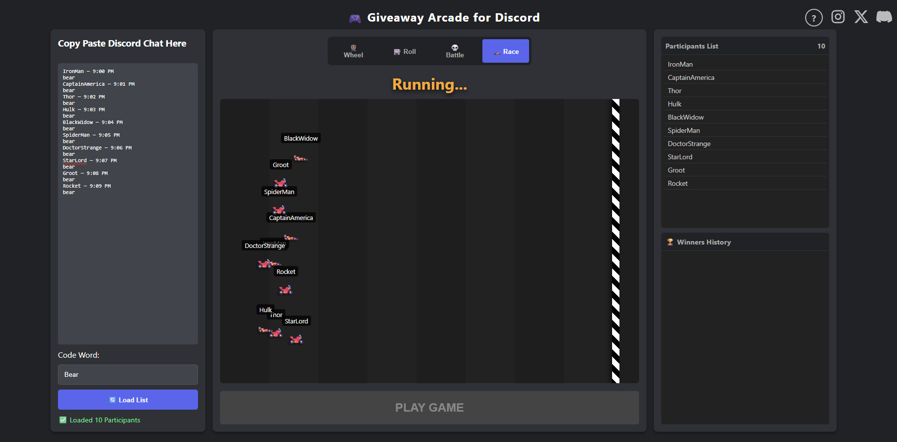
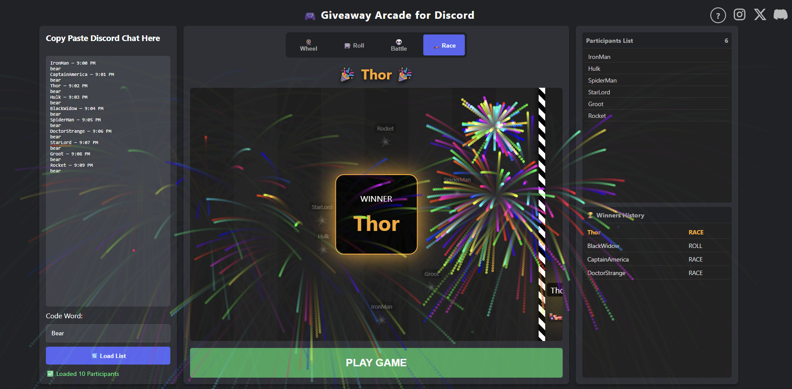

# 🎮 Giveaway Arcade for Discord

A free, browser-based tool designed to make Discord community giveaways exciting and transparent. Stop scrolling through chat manually—turn your giveaway into a game!

<!-- 1. Cover Image -->


### 🔴 [CLICK HERE TO USE THE TOOL (Live Demo)](https://lileshborkar.github.io/Giveaway-Arcade-for-Discord/)

---

## 🧪 Try it now! (Sample Data)
Want to see how it works? **Copy the text block below** and paste it into the tool to test the games immediately.

**Code Word:** `bear`

```text
IronMan — 9:00 PM
bear
CaptainAmerica — 9:01 PM
bear
Thor — 9:02 PM
bear
Hulk — 9:03 PM
bear
BlackWidow — 9:04 PM
bear
SpiderMan — 9:05 PM
bear
DoctorStrange — 9:06 PM
bear
StarLord — 9:07 PM
bear
Groot — 9:08 PM
bear
Rocket — 9:09 PM
bear
AntMan — 9:10 PM
bear
BlackPanther — 9:11 PM
bear
ScarletWitch — 9:12 PM
bear
Vision — 9:13 PM
bear
Falcon — 9:14 PM
bear
WinterSoldier — 9:15 PM
bear
Loki — 9:16 PM
bear
Thanos — 9:17 PM
bear

✨ Gameplay Preview
Choose from 4 different game modes to pick your winner!
<!-- 2. Gameplay Image -->

🚀 Features
4 Game Modes:
🏎️ Survival Race: A chaotic drag race where participants crash out until one winner remains.
💀 Battle Royale: Players are eliminated one-by-one from a grid.
🎰 Loot Roll: A classic horizontal spinner (CS:GO style).
🎡 Spin Wheel: The traditional lucky wheel.
Smart Parsing: Automatically detects Username — Time formats from Discord chat logs.
Duplicate Protection: Filters out users who spam the code word multiple times.
Fireworks Celebration: Automatic visual effects for the winner.
100% Client-Side: No data is sent to any server. It runs entirely in your browser for privacy.

📚 How to Use
The tool includes a built-in guide to help you copy-paste correctly.
<!-- 3. Help Image -->

Copy Chat: Go to your Discord channel, press Ctrl+A (Select All) and Ctrl+C (Copy).
Paste: Paste the text into the tool.
Set Keyword: Enter the specific word users had to type (e.g., "bear" or "cooked").
Play: Select a game mode and click PLAY.
🛠️ Installation
No installation needed! Just use the Live Link.
If you want to run it locally:
Download index.html from this repository.
Open it in Chrome, Edge, or Firefox.
