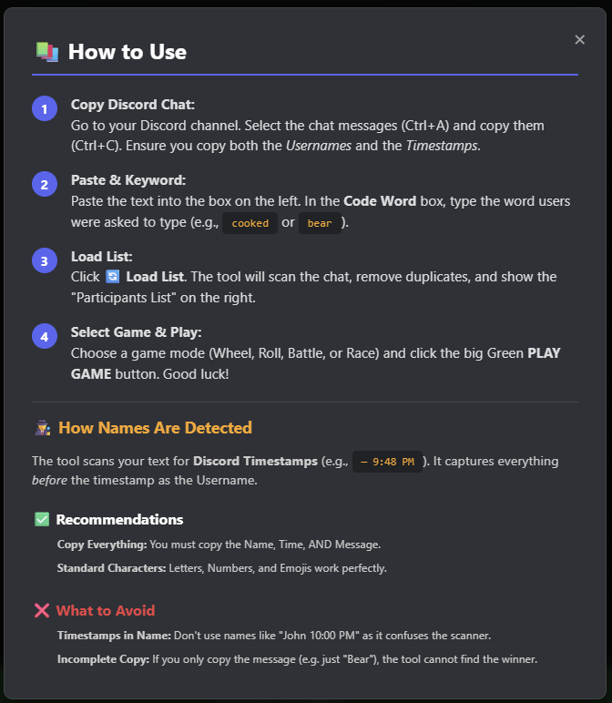

# 🎮 Giveaway Arcade for Discord

A **free, browser-based giveaway tool** built to make Discord community events *fun, fair, and visually exciting*.  
Stop scrolling through walls of chat — turn your giveaway into a game!


---

### 🔴 **[CLICK HERE TO USE THE TOOL (Live Demo)](https://lileshborkar.github.io/Giveaway-Arcade-for-Discord/)**

---

## 🧪 Try It Instantly (Sample Data)

Want to test the arcade without setting up anything?  
**Copy the text below and paste it into the tool.**

**Sample Code Word:** `bear`

```text
IronMan — 9:00 PM
bear
CaptainAmerica — 9:01 PM
bear
Thor — 9:02 PM
bear
Hulk — 9:03 PM
bear
BlackWidow — 9:04 PM
bear
SpiderMan — 9:05 PM
bear
DoctorStrange — 9:06 PM
bear
StarLord — 9:07 PM
bear
Groot — 9:08 PM
bear
Rocket — 9:09 PM
bear
AntMan — 9:10 PM
bear
BlackPanther — 9:11 PM
bear
ScarletWitch — 9:12 PM
bear
Vision — 9:13 PM
bear
Falcon — 9:14 PM
bear
WinterSoldier — 9:15 PM
bear
Loki — 9:16 PM
bear
Thanos — 9:17 PM
bear
```

---

## ✨ Gameplay Preview

Choose from **4 unique game modes**, each offering a different style of winner selection.


---

## 🚀 Features

### 🎮 Four Game Modes
- 🏎️ **Survival Race** – A chaotic drag race where players crash out until only one remains.  
- 💀 **Battle Royale** – A grid-style elimination game.  
- 🎰 **Loot Roll** – Classic horizontal spinner (CS:GO style).  
- 🎡 **Spin Wheel** – The traditional lucky wheel.

### 🧠 Smart Chat Parsing  
Automatically detects messages in the `Username — Time` format from Discord logs.

### 🔁 Duplicate Protection  
Users typing the code word multiple times are only counted *once*.

### 🎆 Fireworks Celebration  
Beautiful animated celebration for the winner.

### 🔒 100% Client-Side  
**No servers, no data collection.** Everything runs inside your browser.

---

## 📚 How to Use

The tool includes a built-in guide, but here’s a quick version:



1. **Copy Chat**  
   - In your Discord channel: press **Ctrl + A** → **Ctrl + C**.

2. **Paste into the Tool**  
   - Paste the chat log in the text box.

3. **Set the Keyword**  
   - Enter the code word users had to type (e.g., `bear`, `cooked`).

4. **Play a Game Mode**  
   - Select a mode → click **PLAY** → watch the winner be chosen live!

---

## 🛠️ Installation (Optional)

No installation needed — just use the **Live Demo**.

If you want to run it locally instead:

1. Download the repo.  
2. Make sure these files are in the **root folder**:
   - `index.html`
   - `Main.png`
   - `Gameplay.png`
   - `Help.png`
3. Open `index.html` in **Chrome, Edge, or Firefox**.

---

## 👨‍💻 Created By  
**Lilesh Borkar**
